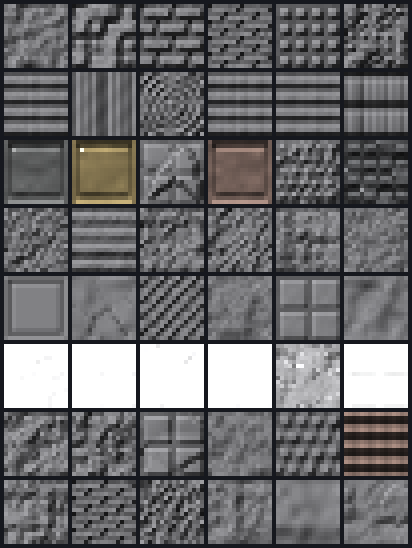

# Skies PBR — pack de textures PBR pour shaders

**Minecraft 1.21.1 · NeoForge · FTB Skies 2 · format LabPBR 1.3**

Un pack de ressources qui donne du **relief, de la brillance, du métal et de la
lumière** à tes blocs sous shaders, sans changer une seule couleur du jeu.



*Aperçu calculé à partir des cartes du pack (albédo volontairement neutre : on
juge le relief et la matière, pas la couleur). Produit par `tools/preview.py`.*

---

## À lire en premier : ce que fait (et ne fait pas) ce pack

Ce pack **ne remplace aucune texture**. Il ajoute, à côté de chaque texture, deux
cartes que les shaders savent lire :

| Fichier | Rôle |
|---|---|
| `stone_n.png` | relief : normales, occlusion ambiante, hauteur pour le parallaxe (POM) |
| `stone_s.png` | matière : brillance, réflectance/métal, porosité ou diffusion, émission |

Conséquences directes :

- **Sans shader, tu ne verras strictement aucune différence.** C'est normal :
  Minecraft vanilla ignore ces cartes. Il faut Iris + un shader compatible LabPBR.
- Tes textures gardent exactement l'apparence de FTB Skies 2. Le pack est
  **cumulable** avec n'importe quel pack de textures : mets-le simplement
  au-dessus dans la liste.
- Le pack ne contient **aucune texture du jeu** : uniquement des cartes générées.
  Rien de redistribué, rien qui puisse entrer en conflit visuel.

Concrètement, sous shaders : la pierre accroche la lumière, le métal réfléchit
vraiment, la laine devient mate, le verre devient net, la pierre de lumière et
les lanternes éclairent par elles-mêmes, et les briques prennent du creux.

---

## Installation dans FTB Skies 2

### 1. Le shader (obligatoire)

FTB Skies 2 tourne sur **Minecraft 1.21.1 / NeoForge**. Le mod qui charge les
shaders est **Iris** (versions 1.8.x pour NeoForge 1.21.1). Oculus n'est pas
nécessaire et ne va pas jusqu'à 1.21.1.

Si le modpack ne l'inclut pas déjà, ajoute Iris à l'instance, puis dépose un
shader dans le dossier `shaderpacks/`.

Shaders qui exploitent LabPBR (donc ce pack) :

| Shader | Remarque |
|---|---|
| **Complementary Reimagined** | le plus sûr pour commencer, très bon rapport qualité/performances |
| **Complementary Unbound** | rendu plus neutre/réaliste, même moteur |
| **Rethinking Voxels** | éclairage voxel, plus gourmand, très beau sur les blocs émissifs |
| **BSL** | classique, LabPBR pris en charge |
| **Photon** | orienté réalisme |

### 2. Le pack

1. Récupère `SkiesPBR-1.0.0.zip` (voir *Construire le pack* plus bas, ou le
   dossier `build/dist/`).
2. Ouvre le dossier de l'instance FTB Skies 2 :
   - **FTB App** : bouton `...` sur l'instance → *Open Folder*
   - **CurseForge** : `...` → *Open Folder*
   - **Prism / MultiMC** : clic droit → *Folder* → *.minecraft*
3. Copie le `.zip` dans le sous-dossier **`resourcepacks/`**.
4. En jeu : *Options → Packs de ressources* → passe **Skies PBR** à droite, et
   place-le **tout en haut de la pile** (priorité maximale).
5. *Options → Vidéo → Shaders* : sélectionne ton shader.

### 3. Les réglages du shader (l'étape qu'on oublie)

Un pack LabPBR parfait ne fait **rien** si le shader n'est pas configuré pour
lire les cartes. Dans *Options → Vidéo → Shaders → Shader Pack Settings* :

- **Material / Resource Pack → Normal maps** : activé
- **Material / Resource Pack → Specular maps** : activé
- **Format** : `LabPBR` (et non `SEUS` / `oldPBR`)
- **Parallax Occlusion Mapping (POM)** : activé si tu veux le relief en volume
  — c'est le réglage le plus coûteux en performances
- **POM depth / quality** : baisse la profondeur si les bords des blocs
  « bavent » de près

Sur Complementary, ces options sont dans *Material* ; sur BSL dans
*Material / Parallax*.

---

## Ce que couvre le pack

**503 textures** de blocs vanilla 1.21.1, réparties par famille de matériau :

- pierres, roches profondes, tuf, blackstone, basalte, calcite
- briques, tuiles, blocs ciselés, grès et grès rouge
- tous les bois 1.21.1 (chêne, épicéa, bouleau, acajou, acacia, chêne noir,
  palétuvier, cerisier, bambou) + tiges du Nether
- terres, sables, graviers, argiles, neige, glaces
- tous les minerais (surface, roche profonde, Nether) et blocs bruts
- métaux avec leurs **indices LabPBR réels** : fer (230), or (231), cuivre (234)
  — le cuivre perd sa brillance au fil des quatre stades d'oxydation
- verres, verres teintés, terres cuites, terres cuites vernissées, bétons,
  poudres de béton, laines
- Nether, End, prismarine, sculk, améthyste
- **36 textures émissives** : pierre lumineuse, lanternes, torches, lampes de
  redstone allumées, champilampes, grenouillumes, obsidienne pleureuse,
  ampoules de cuivre, tiges de l'End, catalyseurs sculk…

Les blocs de mods ne sont **pas** couverts par défaut : voir la section
suivante, qui règle exactement ce point.

---

## Aller plus loin : le mode référence (fortement recommandé)

Par défaut, le relief est **déduit de la famille du matériau** (une brique
reçoit un appareillage de briques, une bûche des fibres verticales, etc.). C'est
propre et cohérent, mais ça ne « voit » pas les vraies textures.

Si tu pointes le générateur vers les textures de ton instance, il fait beaucoup
mieux :

```bash
python3 tools/build.py --vanilla /chemin/vers/assets --all-namespaces --zip
```

Ce mode :

- **dérive le relief de la vraie image** (les creux suivent le dessin réel) ;
- **couvre les blocs de tous les mods** du modpack — Create, Mekanism, Ars
  Nouveau, etc. — en devinant le matériau d'après le nom du bloc, et en écrivant
  les cartes dans le namespace du mod (`assets/<modid>/textures/block/…`), seul
  endroit où Iris ira les chercher ;
- respecte la **transparence** : les pixels ajourés (feuillages, barreaux)
  reçoivent une normale neutre, ce qui évite les artefacts de parallaxe ;
- limite l'**émission aux pixels réellement lumineux** (les veines de
  l'obsidienne pleureuse, pas le bloc entier) ;
- gère les **textures animées** (taille exacte + `.mcmeta` recopié) et les
  textures **HD** d'un pack 32× ou 64×.

### Où trouver les textures de référence

Les textures vanilla sont dans le `.jar` du client :

```bash
mkdir -p /tmp/mcassets && cd /tmp/mcassets
unzip -o "<instance>/.minecraft/versions/1.21.1/1.21.1.jar" 'assets/*' -d .
python3 tools/build.py --vanilla /tmp/mcassets --zip
```

Pour les blocs de mods, extrais aussi les `.jar` du dossier `mods/` dans le même
arbre `assets/`, puis relance avec `--all-namespaces`.

> Les textures d'origine servent uniquement de **source de calcul**. Elles ne
> sont jamais copiées dans le pack produit — un test automatisé le vérifie.

---

## Construire le pack

Aucune dépendance : **Python 3.8+** et rien d'autre (le codec PNG est inclus).

```bash
python3 tools/build.py --zip          # génère build/pack/ et build/dist/*.zip
python3 tools/validate.py             # vérifie la conformité LabPBR
python3 tools/preview.py              # aperçu éclairé, sans lancer le jeu
python3 tests/test_pipeline.py        # 29 tests
```

Options utiles :

| Option | Effet |
|---|---|
| `--vanilla <dir>` | dérive les cartes des vraies textures |
| `--all-namespaces` | couvre aussi les blocs de mods |
| `--no-pom` | aucun relief en volume (hauteur plate) — si le POM te gêne |
| `--no-ao` | désactive l'occlusion ambiante intégrée |
| `--blend 0..1` | dosage entre relief réel et motif procédural (0,65 par défaut) |
| `--zip` | produit l'archive installable |

`tools/preview.py` produit `build/preview.png` : une planche de vignettes
éclairées calculées à partir des cartes générées. C'est le moyen le plus rapide
de juger un réglage sans relancer Minecraft.

---

## Personnaliser un matériau

Tout se règle dans `tools/materials.py`. Exemple — rendre l'obsidienne plus
miroir et moins profonde :

```python
add(["obsidian"], derive(OBSIDIAN, smooth=210, pom=0.20))
```

Les champs disponibles :

| Champ | Plage | Rôle |
|---|---|---|
| `smooth` | 0–255 | brillance perçue (0 mat, 255 miroir) |
| `f0` | 0–229 ou `METAL_*` | réflectance ; au-delà de 229 c'est un métal |
| `porosity` | 0–64 | absorption d'eau (sable 64, laine 38, bois 12) |
| `sss` | 0–255 | diffusion sous la surface (feuillages, glace, slime) |
| `emission` | 0.0–1.0 | lumière propre |
| `relief` | ~0.1–1.5 | force du relief |
| `pom` | 0.0–1.0 | profondeur du parallaxe |
| `layers` | motifs | dessin du relief (17 motifs dans `patterns.py`) |

`porosity` et `sss` partagent le même canal : ils s'excluent mutuellement.

---

## Dépannage

**Je ne vois aucune différence.**
Vérifie dans l'ordre : un shader est-il actif ? les *normal maps* et *specular
maps* sont-elles activées dans les options du shader ? le pack est-il **au-dessus**
des autres dans la liste ? Sans shader, il est parfaitement normal de ne rien voir.

**Le pack est marqué « Incompatible » en rouge.**
Ce n'est qu'un avertissement de version : confirme, le pack se charge normalement.
Un pack qui **n'apparaît pas du tout** dans la liste, c'est un autre problème
(`pack.mcmeta` absent, ou zip contenant un dossier de trop à la racine).

**Les blocs de mods n'ont pas de relief.**
Attendu avec le pack par défaut. Iris cherche les cartes dans le namespace du
mod : relance avec `--vanilla … --all-namespaces`.

**Les bords des blocs bavent, il y a des trous.**
C'est le POM trop profond. Baisse *POM depth* dans le shader, ou régénère avec
`--no-pom`.

**Tout brille comme du plastique mouillé.**
Un `smooth` ou un `f0` trop haut sur une famille. Baisse `smooth` dans
`materials.py` et régénère.

**Le rendu est correct de près et bizarre de loin.**
Vérifie que `assets/minecraft/optifine/texture.properties` est bien présent dans
le pack : sans lui, Iris filtre les cartes `_s` en linéaire et mélange les
identifiants de métaux avec l'émission. `tools/validate.py` le contrôle.

---

## Structure du dépôt

```
ftb-skies-2-pbr/
├── tools/
│   ├── pngio.py       codec PNG pur Python (lecture/écriture RGBA)
│   ├── patterns.py    17 motifs de relief tuilables + normales/occlusion
│   ├── materials.py   catalogue : 503 textures et leurs propriétés LabPBR
│   ├── build.py       génération du pack
│   ├── validate.py    contrôle de conformité LabPBR
│   └── preview.py     rendu d'aperçu hors du jeu
├── tests/
│   └── test_pipeline.py   29 tests (codec, motifs, encodage, mode référence)
└── build/             produit par build.py (non versionné)
```

---

## Notes techniques

Le pack respecte la spécification **LabPBR 1.3** :

- `_n` : R/G = normale tangente en convention **DirectX / Y−** (le vert pointe
  vers le bas), B = occlusion ambiante, A = hauteur (jamais 0, ce qui casserait
  le POM de certains shaders) ;
- `_s` : R = brillance perçue, G = réflectance (les métaux utilisent les indices
  nommés 230–237, la plage 238–254 réservée est évitée), B = porosité (0–64) ou
  diffusion (65–255), A = émission — avec **255 = aucune émission**, le piège
  classique du format, qu'un test verrouille explicitement ;
- `assets/minecraft/optifine/texture.properties` déclare `format = lab-pbr/1.3`,
  ce qui active côté Iris le filtrage adapté aux canaux discrets du `_s` ;
- toutes les cartes sont écrites en **PNG RGBA 32 bits** : l'alpha y est une
  donnée, pas une transparence.

`pack_format` vaut **34** (1.21 / 1.21.1), avec `supported_formats` `[34, 46]`
pour couvrir 1.21 → 1.21.4 sans avertissement.

---

## Licence

Contenu généré, libre d'utilisation, de modification et de redistribution.
Aucune ressource de Mojang ou d'un mod n'est incluse dans le pack.
